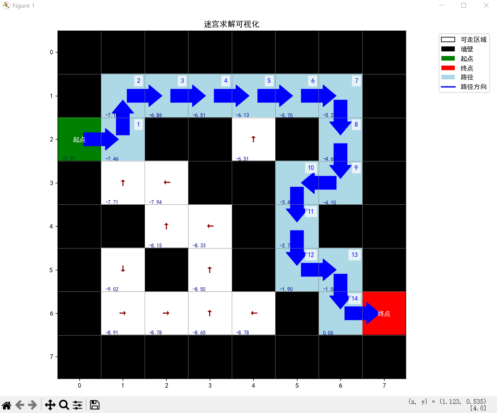

# Assignment ：the application of MDP in maze

## 1. MDP的建模

### 1.1 状态空间（States）

* **定义**：每个非墙壁格子的坐标 `(i, j)`为一个状态，共 `H×W`个状态（`H`为行数，`W`为列数）。
* **示例**：若迷宫为 6×6 网格，状态集合为所有白色格子的 `(i, j)`坐标（假设起点为 `(0, 0)`，终点为 `(5, 5)`）。

### 1.2 动作空间（Actions）

* **定义**：`N, E, S, W`分别对应上下左右移动，共 4 种动作。

### 1.3 转移概率（Transition Probability）

* **确定性转移**：执行动作后，若移动方向无墙壁，则以概率 1 到达相邻格子；若有墙壁，则停留原处（概率 1）。
* 公式：

  ```
  P(s′∣s,a)=⎩⎨⎧110若 s′ 是合法移动后的格子,若 s′=s（遇墙壁）,其他.
  ```

### 1.4 奖励函数（Rewards）

* **每步惩罚**：非终止状态下每步奖励为 `-1`。
* **终止状态**：到达终点时奖励为 `0`，且终止过程（即不再转移）。

### 1.5 折扣因子（Discount Factor）

* 取 `γ = 0.9`（平衡即时与长期奖励）。

## 2. 价值迭代算法

价值迭代（Value Iteration）算法，我们需要从马尔可夫决策过程（MDP）的核心目标出发： **找到每个状态的最优价值（即该状态能带来的最大累积未来奖励），并根据价值提取最优动作策略** 。

价值迭代的本质是 **用动态规划的思想，迭代更新每个状态的“价值函数”** ，直到价值收敛到稳定值。最终根据收敛的价值函数，反推每个状态的最优动作。

### 2.1 算法步骤详细说明

#### （1）初始化：给所有状态“估个初始价值”

一开始，我们对每个状态的价值一无所知，因此**所有状态的价值初始化为 0**。
形式化表达：对所有状态 $s$，初始化价值函数

$$
V_0(s) = 0
$$

- $V_k(s)$：第 $k$ 次迭代后，状态 $s$ 的价值（即该状态能带来的 **最大累积未来奖励**）。

#### （2）迭代更新价值：不断“修正”每个状态的价值

重复以下操作，直到价值的**最大变化量**小于预设的阈值（比如 $\epsilon=10^{-6}$，表示价值几乎不再变化）：

对于每个**非终止状态** $s$（比如迷宫中未到终点的格子），计算新价值：

$$
V_{k+1}(s) = \max_a \left[ R(s,a) + \gamma \cdot V_k(s') \right]
$$

对于**终止状态**（比如迷宫终点），价值固定为 0（到达终点后无后续奖励）。

**关键概念解释**（对应公式中的符号）：

- $R(s,a)$：执行动作 $a$ 后的**即时奖励**（比如迷宫中每走一步罚 -1，到终点奖 0）；
- $s'$：执行动作 $a$ 后转移到的状态（若撞墙/边界，则 $s'=s$，即留在原地）；
- $\gamma$：**折扣因子**（$0\leq\gamma\leq1$，越接近 1 越看重长期奖励，越接近 0 越看重短期奖励）；
- $\max_a$：对所有可能的动作 $a$（比如上下左右），取“即时奖励+未来折扣价值”的**最大值**。

#### （3）提取最优策略：根据价值选“最好的动作”

当价值函数收敛后（$V_{k+1} \approx V_k$），每个状态的**最优动作**是使“即时奖励+折扣后未来价值”最大的动作：

$$
\pi^*(s) = \arg\max_a \left[ R(s,a) + \gamma \cdot V^*(s') \right]
$$

其中：

- $V^*$：收敛后的价值函数（即最终的 $V_{k+1}$）；
- $\arg\max_a$：不是取“最大值”，而是取**能产生这个最大值的动作**（即最优策略）。

### 2.2 算法总结

价值迭代的核心是“价值驱动策略”：

1. 先通过迭代计算每个状态的**最大累积未来奖励**（价值函数）；
2. 再根据价值函数反推每个状态的**最优动作**（策略）。

通过这个简单案例，我们可以清晰看到：

* 价值函数的收敛过程，本质是 **逐步学习每个状态的“长期价值”** ；
* 最优策略的提取，是基于“当前动作能带来最大价值增量”的贪心选择。

**一句话总结**：价值迭代就是“先算每个状态有多好，再选让状态变好的动作”。

## 3. 关键代码

以下是MDP的核心代码说明(不包含可视化部分代码)

### 3.1 迷宫环境类 (MazeEnv)

```python
class MazeEnv:
    def __init__(self, maze, start, goal):
        self.maze = maze
        self.rows = len(maze)
        self.cols = len(maze[0])
        self.start = start
        self.goal = goal
        self.actions = ['N', 'E', 'S', 'W']
        self.action_deltas = {'N': (-1, 0), 'E': (0, 1), 'S': (1, 0), 'W': (0, -1)}
  
        # 提取所有非墙壁状态
        self.states = []
        for i in range(self.rows):
            for j in range(self.cols):
                if self.maze[i][j] == 0:
                    self.states.append((i, j))
        self.terminals = {goal}
  
    def get_reward(self, state, action):
        next_state = self.get_next_state(state, action)
        return 0 if next_state == self.goal else -1
  
    def get_next_state(self, state, action):
        i, j = state
        di, dj = self.action_deltas[action]
        ni, nj = i + di, j + dj
        if 0 <= ni < self.rows and 0 <= nj < self.cols and self.maze[ni][nj] == 0:
            return (ni, nj)
        else:
            return state
  
    def is_terminal(self, state):
        return state == self.goal
```

**说明**：

* 定义了迷宫环境的核心逻辑
* 初始化迷宫矩阵、起点、终点和动作空间
* 提取所有可通行状态（非墙壁）
* 实现状态转移函数：根据动作计算下一个状态，处理墙壁和边界
* 实现奖励函数：到达终点奖励0，否则惩罚-1
* 判断状态是否为终止状态（终点）

### 3.2 价值迭代算法 (value_iteration)

```python
def value_iteration(env, gamma=0.9, epsilon=1e-6):
    V = {s: 0 for s in env.states}
  
    while True:
        delta = 0
        V_new = V.copy()
  
        for s in env.states:
            if env.is_terminal(s):
                V_new[s] = 0
                continue
      
            action_values = []
            for a in env.actions:
                reward = env.get_reward(s, a)
                next_s = env.get_next_state(s, a)
                action_value = reward + gamma * V[next_s]
                action_values.append(action_value)
      
            V_new[s] = max(action_values)
            delta = max(delta, abs(V_new[s] - V[s]))
  
        V = V_new
        if delta < epsilon:
            break
  
    # 提取最优策略
    policy = {}
    for s in env.states:
        if env.is_terminal(s):
            policy[s] = None
            continue
  
        action_values = []
        for a in env.actions:
            reward = env.get_reward(s, a)
            next_s = env.get_next_state(s, a)
            action_value = reward + gamma * V[next_s]
            action_values.append(action_value)
  
        best_action_idx = np.argmax(action_values)
        best_action = env.actions[best_action_idx]
        policy[s] = best_action
  
    return V, policy
```

**说明**：

* 实现价值迭代算法核心逻辑
* 初始化所有状态价值为0
* 迭代更新状态价值函数直到收敛
* 每个状态的价值更新为所有可能动作的最大期望回报
* 收敛后提取最优策略：每个状态选择价值最大的动作
* 使用折扣因子γ平衡即时奖励和未来奖励

### 3.3 路径生成函数 (generate_path)

```python
def generate_path(env, policy, start):
    path = [start]
    current = start
  
    while not env.is_terminal(current):
        action = policy[current]
        current = env.get_next_state(current, action)
        path.append(current)
        if len(path) > 100:
            break
  
    return path
```

**说明**：

* 根据最优策略生成从起点到终点的路径
* 从起点开始，按照策略选择动作
* 执行状态转移直到到达终点
* 添加安全限制防止无限循环
* 返回路径坐标序列

### 3.4 主程序逻辑

```python
if __name__ == "__main__":
    # 定义迷宫
    maze = [
        [1, 1, 1, 1, 1, 1, 1, 1],
        [1, 0, 0, 0, 0, 0, 0, 1],
        [0, 0, 1, 1, 0, 1, 0, 1],
        [1, 0, 0, 1, 1, 0, 0, 1],
        [1, 1, 0, 0, 1, 0, 1, 1],
        [1, 0, 1, 0, 1, 0, 0, 1],
        [1, 0, 0, 0, 0, 1, 0, 0],
        [1, 1, 1, 1, 1, 1, 1, 1]
    ]
    start = (2,0)
    goal = (6,7)
  
    # 初始化环境
    env = MazeEnv(maze, start, goal)
    gamma = 0.9
  
    # 运行价值迭代
    V, policy = value_iteration(env, gamma)
  
    # 生成最优路径
    path = generate_path(env, policy, start)
  
    # 输出路径
    print("\n最优路径坐标序列：")
    for i, pos in enumerate(path):
        print(f"步骤 {i}: ({pos[0]}, {pos[1]})")
```

**说明**：

* 定义迷宫矩阵（0表示可通行，1表示墙壁）
* 设置起点和终点坐标
* 初始化迷宫环境
* 运行价值迭代算法求解最优策略
* 根据最优策略生成路径
* 输出路径坐标序列

## 4. 实验结果与分析

### 4.1 可视化图像



**图像说明：**

- 左下角是价值迭代算法收敛后，最终各个状态的价值
- 白色格子中间是各个状态的最优动作，而浅蓝色格子是最优路径

**结果分析：**

可以看到算法是有效的，成功找到了最优的完整路径，绕开了所有黑色墙壁区域，且价值迭代算法中的各状态价值成功收敛。路径未出现循环或重复访问统一状态的情况，且各状态距离终点越远，价值越低，都符合期望，再次说明算法是成功且有效的。

对算法的效率，这里不做具体的量化分析，在这个简单的迷宫下，算法运行的时间是很短的，很快就可以收敛，从而可以说明价值迭代算法在这种较小规模问题中表现良好。

## 5. 实验源码

实验源码参考Github链接：
