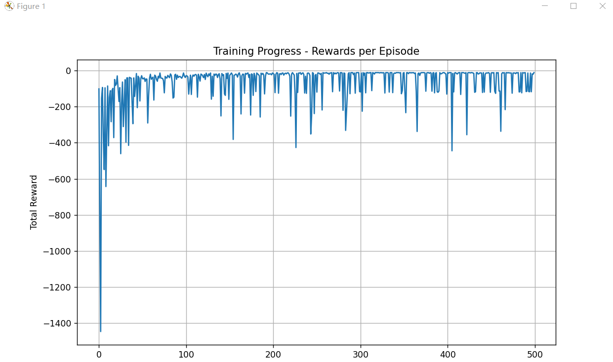
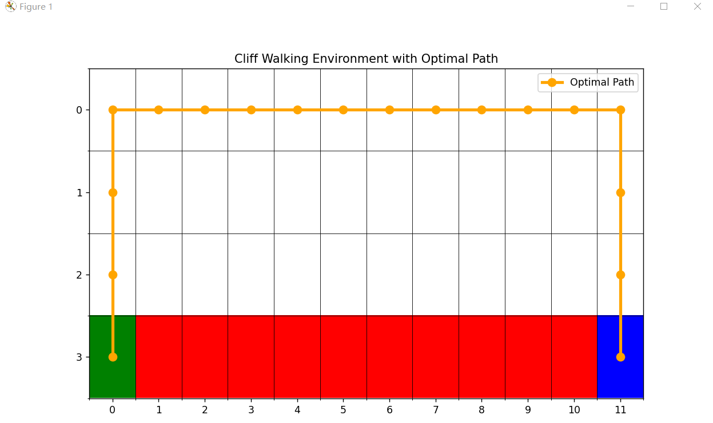
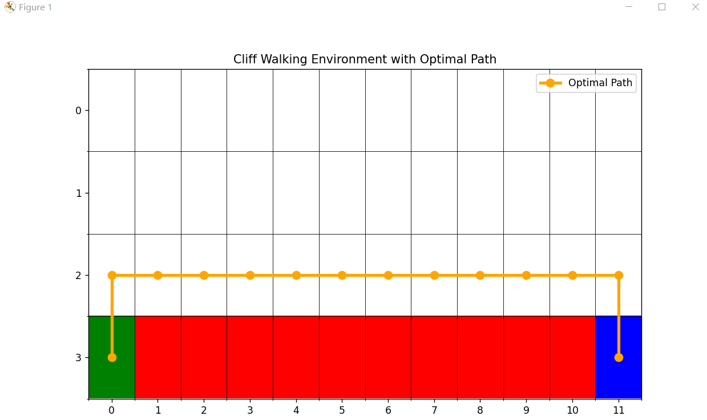

# 基于Cliff Walk例子实现SARSA、Q-learning算法

姓名：吴琦      学号：21306219       专业：计算机科学与技术

## 1. 算法原理

SARSA和Q-learning是两种非常经典且重要的时序差分（Temporal Difference, TD）控制算法。它们都用于学习状态-动作价值函数（Q函数），但具体的思想和策略类型有所不同，接下来进行简单介绍。

### SARSA：同策略（On-Policy）学习

SARSA如它的名字一样，涉及的五个关键元素：当前**S**tate, **A**ction, **R**eward, 下一个**S**tate, 下一个**A**ction (S, A, R, S', A')。它是一种**同策略**算法，意味着它评估和改进的策略（目标策略）与它实际执行动作的策略（行为策略）是同一个策略。

**1. 核心思想**

SARSA的更新基于当前策略下实际采取的 **行动路径** 。在Cliff Walk中，智能体不仅会考虑下一步状态 `S‘`的奖励，还会考虑在 `S‘`状态下， **根据当前策略（如ε-greedy）真正会选择的下一个动作 `A‘`** 所对应的Q值。

**2. 数学公式**

SARSA的Q值更新公式如下：

`Q(S, A) ← Q(S, A) + α * [ R + γ * Q(S', A') - Q(S, A) ]`

其中：

* `α`是学习率，控制着新信息覆盖旧信息的程度。
* `R`是执行动作 `A`后获得的即时奖励。
* `γ`是折扣因子，权衡当前奖励和未来奖励的重要性。
* `Q(S', A‘)`是在下一个状态 `S’`下， **根据当前策略（如ε-greedy）选择的动作 `A‘`** 的Q值。

**3. 在Cliff Walk实验中的体现**

在Cliff Walk环境中，SARSA的这种“保守”特性会表现得非常明显。因为它会考虑到探索行为（随机动作）可能带来的风险（掉下悬崖），所以最终学到的策略通常会选择一条 **更安全、但可能稍长的路径** ，它会远离悬崖边缘，以避免因随机探索而掉下悬崖受到巨大惩罚。

### Q-learning：异策略（Off-Policy）学习

Q-learning是一种**异策略**算法。这意味着它用来学习最优值函数（目标策略）的策略，和它用来选择动作并与环境交互的策略（行为策略，如ε-greedy）可以是不同的。

**1. 核心思想**

Q-learning直接学习 **最优价值函数** ，而不管智能体正在遵循什么样的探索策略。它的更新目标直接瞄准了在下一个状态 `S‘`中， **所有可能的动作里能带来的最大Q值** ，而不管当前策略在 `S‘`下实际会采取哪个动作。

**2. 数学公式**

Q-learning的Q值更新公式如下：

`Q(S, A) ← Q(S, A) + α * [ R + γ * max_{a'} Q(S', a') - Q(S, A) ]`

这个公式与SARSA最关键的区别在于 `max_{a'} Q(S', a')`。它使用下一个状态 `S’`的**所有可能动作的Q值中的最大值**来更新当前的Q值。

**3. 在Cliff Walk实验中的体现**

由于Q-learning总是乐观地估计未来收益（使用最大值），在Cliff Walk环境中，它往往会学到一条 **更短、但更危险的路径** ——即紧贴着悬崖边的最优路径。因为它假设在后续的状态中都会采取最优动作，所以不害怕探索策略可能带来的风险。当然，在训练过程中，由于探索（ε-greedy），它仍然有可能掉下悬崖。

### 二者核心区别

| 特性               | SARSA                                                       | Q-learning                                                         |
| ------------------ | ----------------------------------------------------------- | ------------------------------------------------------------------ |
| **策略类型** | **同策略**                                            | **异策略**                                                   |
| **更新依据** | 下一个**实际执行**的动作 `A‘`的Q值：`Q(S', A‘)` | 下一个状态**所有可能动作**的最大Q值：`max_{a'} Q(S', a‘)` |
| **学习目标** | 优化**当前行为策略** （包含探索）                     | 直接学习**最优策略** （无视探索）                            |
| **路径风格** | 倾向于**安全、保守**的路径                            | 倾向于**风险、最优**的路径                                   |
| **公式差异** | `... + γ * Q(S', A‘)`                                   | `... + γ * max_{a'} Q(S', a’)`                                 |

## 2. 核心代码

### 2.1 SARSA部分代码

```
class SARSAAgent:
    def choose_action(self, state):
        """ε-greedy策略选择动作"""
        if np.random.random() < self.epsilon:
            return np.random.randint(0, 4)  # 随机探索
        else:
            return np.argmax(self.q_table[state])  # 贪婪选择
  
    def update(self, state, action, reward, next_state, next_action, done):
        """SARSA更新Q值"""
        if done:
            target = reward
        else:
            target = reward + self.gamma * self.q_table[next_state][next_action]
  
        self.q_table[state][action] += self.alpha * (target - self.q_table[state][action])

def train_sarsa(env, agent, episodes=500):
    """训练SARSA智能体"""
    for episode in range(episodes):
        state = env.reset()
        action = agent.choose_action(state)  # 初始动作
  
        while True:
            # 执行动作，得到下一个状态和奖励
            next_state, reward, done = env.step(action)
            # 选择下一个动作（基于当前策略）
            next_action = agent.choose_action(next_state)
      
            # SARSA更新：使用当前策略选择的下一个动作
            agent.update(state, action, reward, next_state, next_action, done)
      
            # 转移到下一个状态和动作
            state = next_state
            action = next_action
      
            if done:
                break
```

**代码解释：**

SARSA算法通过**同策略学习**来更新Q值，即在每一步中，它使用当前ε-greedy策略 **实际选择的下一个动作a'** 来计算目标Q值（r + γQ(s',a')），然后基于当前动作a和下一个动作a'的Q值差异来更新Q表，这种更新方式使得算法在学习时会考虑到探索行为可能带来的风险，从而倾向于学习更保守但安全的策略。

### 2.2 Q-learning部分代码

```
class QLearningAgent:
    def update(self, state, action, reward, next_state, done):
        """Q-learning更新Q值"""
        if done:
            target = reward
        else:
            # Q-learning与SARSA的关键区别：使用maxQ而不是下一个动作的Q值
            target = reward + self.gamma * np.max(self.q_table[next_state])
  
        self.q_table[state][action] += self.alpha * (target - self.q_table[state][action])

def train_q_learning(env, agent, episodes=500):
    """训练Q-learning智能体"""
    for episode in range(episodes):
        state = env.reset()
  
        while True:
            action = agent.choose_action(state)
            next_state, reward, done = env.step(action)
      
            # Q-learning更新：不需要下一个动作
            agent.update(state, action, reward, next_state, done)
      
            state = next_state
      
            if done:
                break
```

**代码解释：**

Q-learning算法通过**异策略学习**来更新Q值，它在每一步中使用当前ε-greedy策略选择动作进行探索，但在更新Q值时 **不考虑实际采取的下一个动作** ，而是直接使用下一个状态的最大Q值（maxₐ'Q(s',a')）作为目标值，这种"乐观"的更新方式使得算法能够学习到最优策略而不受探索行为的影响，但可能导致在危险环境中采取过于冒险的路径。

## 3. 实验结果

### 3.1 训练曲线对比

**SARSA训练曲线**


**Q-learning训练曲线**



### 3.2 最优路径结果

**SARSA最优路径**



**Q-learning最优路径**



## 4. 结果分析

### 4.1 训练曲线分析

**SARSA训练曲线特点：**

* **收敛相对平稳** ：SARSA的训练曲线呈现出较为平滑的上升趋势
* **奖励值相对稳定** ：在训练后期，也就是收敛后，SARSA的奖励值波动较小，保持在相对稳定的水平
* **学习过程保守** ：由于SARSA采用同策略学习，在探索过程中会考虑到随机动作可能带来的风险，因此训练过程中的奖励下降幅度相对较小

**Q-learning训练曲线特点：**

* **收敛过程波动较大** ：Q-learning的训练曲线显示出较大的波动性
* **奖励值变化剧烈** ：训练过程以及收敛后，经常出现奖励值的急剧下降，也就是说明智能体很容易掉进悬崖
* **学习过程激进** ：Q-learning采用异策略学习，直接追求最优值，导致在训练过程中会频繁尝试危险的悬崖边缘路径

**对比分析：**

SARSA的训练曲线更加平滑稳定，而Q-learning虽然最终可能达到更好的性能，但训练过程更加不稳定，这反映了两者不同的学习哲学：SARSA注重学习过程中的安全性，而Q-learning更注重最终性能的最优性。

### 4.2 最优路径结果分析

**SARSA最优路径特征：**

* **路径安全性高** ：SARSA学习到的路径通常会远离悬崖区域，并且经过多次尝试，发现SARSA的最优路径结果会出现不一样的情况，不一定是最远的路径，但都会远离悬崖
* **路径长度较长** ：为了避免风险，SARSA倾向于选择更安全但更长的路径
* **保守策略** ：体现了SARSA同策略学习的特性，会考虑到探索行为可能带来的风险

**Q-learning最优路径特征：**

* **路径最优性强** ：Q-learning倾向于找到最短路径，即使需要紧贴悬崖
* **风险较高** ：学习到的路径往往紧邻悬崖边缘
* **激进策略** ：反映了Q-learning异策略学习的特性，直接追求最优值而不考虑探索风险

**路径对比分析：**

在Cliff Walk环境中，两种算法展现了明显的策略差异：

* **SARSA**学习到的路径更加安全可靠，适合对安全性要求较高的应用场景
* **Q-learning**学习到的路径虽然风险较高，但效率更高，适合对性能要求极高的场景

这种差异的根本原因在于更新策略的不同：SARSA使用实际采取的下一个动作进行更新，而Q-learning使用下一个状态的最大Q值进行更新。

## 5 实验源码

[shy-57/Reinforcement-Learning: Record the assignments for the reinforcement learning courses in the 2025-1 semester (github.com)](https://github.com/shy-57/Reinforcement-Learning)
